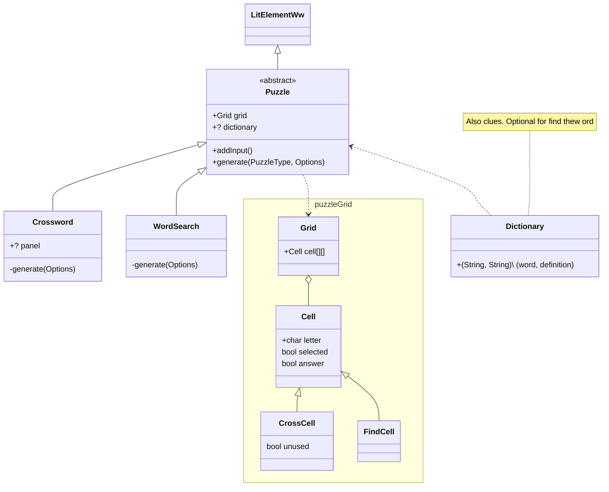

# Word Puzzles Widget

## Proposed structure

I've been told I shouldn't abstract things yet, but rather that I should implement the puzzles separately and then try to simplify things.

Nonetheless here's what I think it might look like later:

